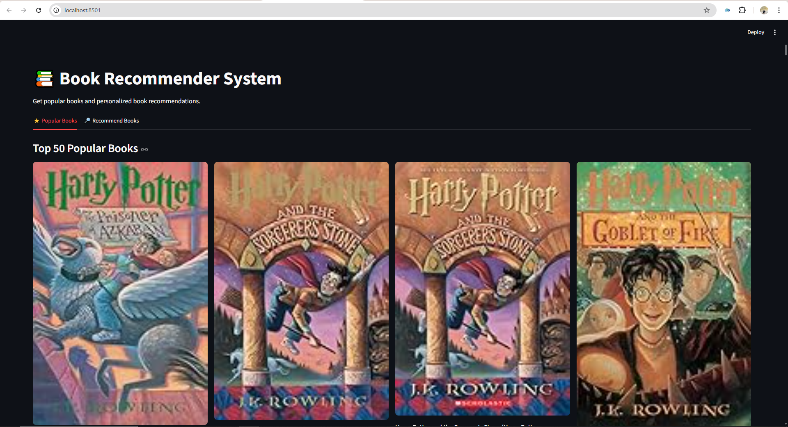
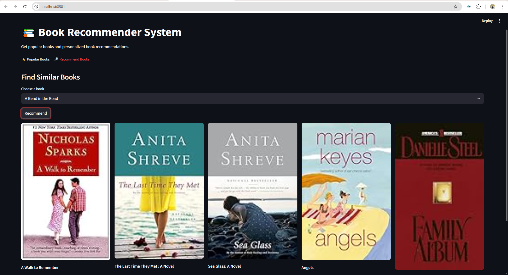
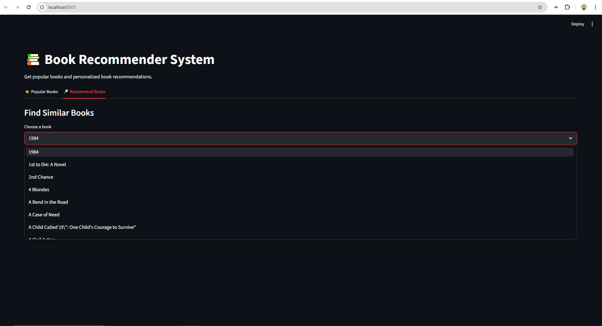

## Book Recommender System -
Explore a smart book recommender that suggests the top 5 similar books based on your interests.

About : In today’s digital world, readers are overwhelmed with countless book choices. Finding the right book can be challenging.

This project solves that problem by building a **content-based book recommender system** that suggests books similar to a selected title.

The system uses text processing, vectorization, and similarity measures to provide fast and relevant recommendations through an interactive web interface.

---

## Features

*  Recommends top 5 similar books
*  Fast retrieval using precomputed similarity matrix
*  Content-based filtering approach
*  Simple and interactive Streamlit UI
*  Efficient caching using Streamlit
*  Handles missing data gracefully

---

## Tech Stack

* Python
* Streamlit
* Pandas
* NumPy
* scikit-learn

---

##  Dataset 

The model is trained on a books dataset containing:

* Book Title
* Author
* Genre
* Description / Summary

Dataset source (from Kaggle) : https://www.kaggle.com/datasets/arashnic/book-recommendation-dataset

---

## How It Works

### 1. Data Preprocessing

* Clean and handle missing values
* Select important columns (title, author, genre, description)

### 2. Feature Engineering

* Combine text features into a single column
* Convert text to lowercase
* Tokenization

### 3. Vectorization

* Use **CountVectorizer** to convert text into numerical vectors

### 4. Similarity Calculation

* Compute **cosine similarity** between book vectors

### 5. Recommendation

* Select a book
* Find similarity scores
* Return top 5 most similar books

---

## Project Preview

| Landing Page | Book Selection | Search Page |
|--------------|----------------|-------------|
|  |  |  |

---

## Project Structure

```text
Book-Recommender-System/
├── app.py
├── README.md
├── requirements.txt
├── .gitignore
├── models/
│   ├── books.pkl
│   ├── pt.pkl
│   ├── popular.pkl
│   └── similarity_scores.pkl
└── screenshots/
    ├── landing_page.png
    ├── book_selection.png
    └── search_page.png
```

---

## Installation & Setup

### Prerequisites
- Python 3.7 or higher  
- pip (Python package manager)  

---

### Step 1: Clone the Repository
git clone https://github.com/halimajahanchowdhury/book-recommender-system.git
cd book-recommender-system

### Step 2: Install Dependencies
pip install -r requirements.txt

### Step 3: Run the Application
streamlit run app.py

---

## Usage

1. Run the app
2. Select a book from dropdown
3. Click **Recommend**
4. View top 5 similar books

---

## Future Improvements

*  Add search with typo tolerance
* Filter by genre, author, year
*  Hybrid recommendation (content + collaborative)
*  Model evaluation metrics
*  Deploy with database integration

---

## 📜 License

This project is licensed under the MIT License.

---

## Acknowledgment

Inspired by real-world recommender systems used by platforms like Netflix and Amazon.

---


## ⚠️⚠️⚠️ Note on Model Files

Due to GitHub file size limits, large model files are not included in this repository.

